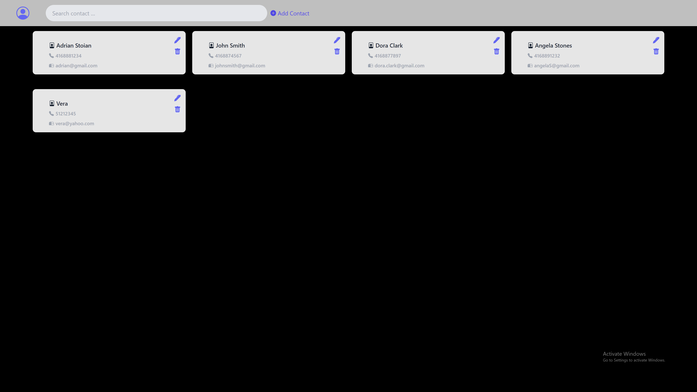
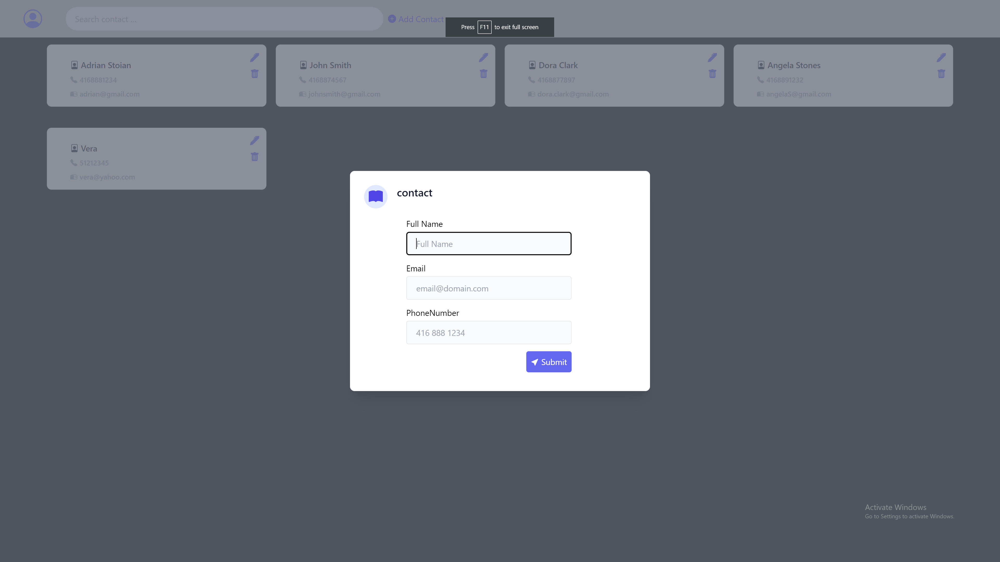

# PhoneBook App

# Introduction

The app allows user to create a contact card with name, phone number and e-mail address. The user can search for a contact in the contact list or update/delete any contact card.

## Usage

- start development server with `npm start` or `sudo npm start`
- the project can be viewed in the browser at [http://localhost:3000](http://localhost:3000)

## Technologies used

- React, Redux-toolkit, Tailwind

## Screenshots

